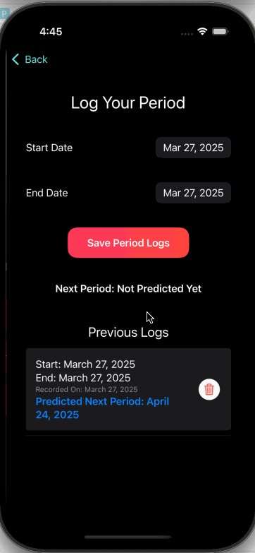

# EmpowerHer Tracker

EmpowerHer Tracker is a SwiftUI-based iOS app designed to empower women by simplifying period tracking while also spreading awareness about women's rights and achievements.

## Why I Built This

I'm from India/SouthAsia, where period health and open conversations around menstruation are still considered taboo. This app is my attempt to normalize these discussions and humanize menstruation and a woman’s body through a simple, welcoming, and educational tool.

## Features

- **Period Tracker**: Log start and end dates, and get a predicted next period date based on cycle length.
- **Women's Rights Awareness**: Scroll through interesting facts about women's rights around the world.
- **Quiz Mode**: Test your knowledge with questions generated from the awareness section.
- **Local Data Storage**: All data is stored on-device using `UserDefaults` — no account or internet needed.

## Technologies Used

- SwiftUI for building a modern and responsive UI
- UserDefaults for lightweight local storage

## Demo



## Future Enhancements

- Add analytics and insights on cycle patterns
- Push notification reminders for upcoming periods
- Support for irregular cycles and more flexible predictions
- Enhanced quiz feature with score history and difficulty levels
- Optional iCloud sync for cross-device support
- Localization for multilingual access
- Resources page with period health tips

## Getting Started

1. Clone the repository:
   ```bash
   git clone https://github.com/Soumya98-dev/EmpowerHer.git
   ```
